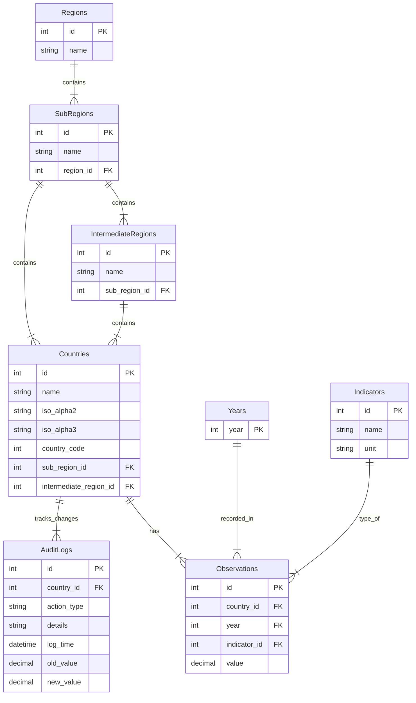

# Final Exam Project - Software Engineering in Construction Information Systems
Cornelius Jefferson Tjahjono - M11405806

## Database Design (ER Diagram)


## Life Expectancy Dashboard

A web-based system to visualize, manage, and analyze global life expectancy data. This project demonstrates full-stack development using Node.js, MySQL, and HTMX for dynamic interactions.

## Tech Stack

* **Backend:** Express.js (Node.js)
* **Frontend:** HJS (Hogan.js templating), Bootstrap 5, HTMX, HTML
* **Database:** MySQL 8.0
* **Containerization:** Docker & Docker Compose
* **Visualization:** Chart.js (for dashboard trends)

## Prerequisites

* **Docker Desktop** (Recommended for easiest setup)

## Setup and Installation
```bash
docker compose up
```
Access the Application Open your browser and navigate to:
1. http://localhost:5806 (localhost in own computer)

## Database Administration
To inspect the database manually while Docker is running, use the following PowerShell command:
```bash
docker compose exec db mysql -u user5806 -ppassword5806 life_expectancy
```

## Features Overview
1. Home - Global Overview: View aggregated statistics - country trend analysis.
2. Country History: Life Expectancy at Birth for selected country over the years
3. Sub-Region Rank: Rank countries by life expectancy for a specific year and sub-region.
4. Region Stats: Calculate average life expectancy per sub-region.
5. Search Country: Find specific country life expectancy data.
6. Add Record: Insert new life expectancy records (based on latest year data) for seleceted country.
7. Update Record: Modify existing records for seleceted country.
8. Delete Records: Remove records by year range for seleceted country.
9. Country Profile: Detailed view of a single country's history and stats.
10. AI Predictor: Linear regression to forecast future life expectancy trends for seleceted country.
11. Audit Logs: Track all Insert, Update, and Delete actions.

## Project Structure

```text
final-exam-m11405806/
├── .git/                        # Git repository data
├── .gitattributes               # Make sure Git not change .csv format
├── app/                         # Main Node.js Application
│   ├── node_modules/                 
│   ├── public/css               # Static assets (CSS, JS)
│   │   └── dashboard.css
│   ├── views/                   # HJS Templates
│   │   ├── 404.hjs              # 404 not found Page
│   │   ├── index.hjs            # Home/Dashboard Page
│   │   └── partials/            # HTMX fragments (feature1_form.hjs, etc.)
│   ├── app.js                   # Express Server Entry Point
│   └── package.json             # Node.js Dependencies
├── data/                        # Database storage / Seed data
│   ├── data1.csv                # Data1 for seeding
│   └── data2.csv                # Data2 for seeding
├── compose.yaml                 # Docker Compose configuration (named 'compose')
├── Dockerfile                   # Docker build instructions
├── etl.sql                      # SQL Init/Migration script (named 'etl')
└── README.md                    # Project Documentation
